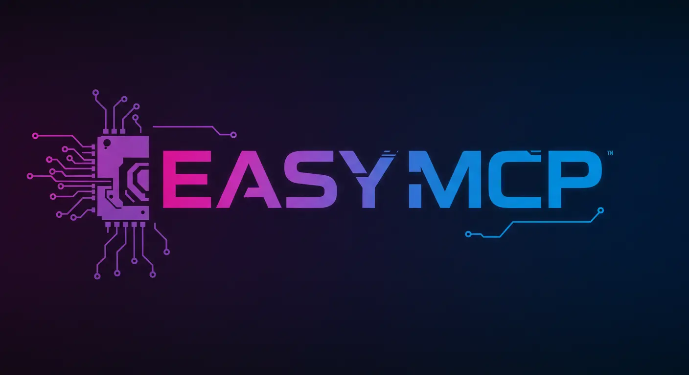

# easy-mcp



> EasyMCP is usable but in beta. Please report any issues you encounter.

EasyMCP is the simplest way to create Model Context Protocol (MCP) servers in TypeScript.

It hides the plumbing, formatting, and other boilerplate definitions behind simple declarations.

Easy MCP allows you to define the bare minimum of what you need to get started. Or you can define more complex resources, templates, tools, and prompts.

## Features

- **Simple Express-like API**: EasyMCP provides a high-level, intuitive API. Define Tools, Prompts, Resources, Resource Templates, and Roots with calls similar to defining endpoints in ExpressJS. Every possible parameter that could be optional is optional and hidden unless you need it.
- **Experimental Decorators API**: Automagically infers tool, prompt, and resource arguments. No input schema definition required!
- **Context Object**: Access MCP capabilities like logging and progress reporting through a context object in your tools.
- **Great Type Safety**: Better DX and fewer runtime errors.

## Beta Limitations

- No support for MCP sampling, yet
- No support for SSE, yet
- No resource update notifications, yet
- Prompts technically accept inputs, but the Typescript SDK suggests they can't. So this functionality feels unfinished.

## Installation

To install EasyMCP, run the following command in your project directory:

```bash
bun install
```

## Quick Start with (Experimental) Decorators API

Also see `examples/express-decorators.ts` or run `bun start:decorators`

EasyMCP's decorator API is dead simple and infers types and input configuration automatically.

But it's *experimental* and may change or have not-yet-discovered problems.

```typescript
import EasyMCP from "./lib/EasyMCP";
import { Tool, Resource, Prompt } from "./lib/experimental/decorators";

class MyMCP extends EasyMCP {

  @Resource("greeting/{name}")
  getGreeting(name: string) {
    return `Hello, ${name}!`;
  }

  @Prompt()
  greetingPrompt(name: string) {
    return `Generate a greeting for ${name}.`;
  }

  @Tool()
  greet(name: string, optionalContextFromServer: Context) {
    optionalContextFromServer.info(`Greeting ${name}`);
    return `Hello, ${name}!`;
  }
}

const mcp = new MyMCP({ version: "1.0.0" });
```

## Complex Example with Decorators API

See `examples/express-express.ts` or run `bun start:express`

```typescript
import EasyMCP from "./lib/EasyMCP";
import { Prompt } from "./lib/decorators/Prompt";
import { Resource } from "./lib/decorators/Resource";
import { Root } from "./lib/decorators/Root";
import { Tool } from "./lib/decorators/Tool";

@Root("/my-sample-dir/photos")
@Root("/my-root-dir", { name: "My laptop's root directory" }) // Optionally you can name the root
class ZachsMCP extends EasyMCP {
  /**
  You can declare a Tool with zero configuration. Relevant types and plumbing will be inferred and handled.

  By default, the name of the Tool will be the name of the method.
  */
  @Tool()
  simpleFunc(nickname: string, height: number) {
    return `${nickname} of ${height} height`;
  }

  /**
   * You can enhance a tool with optional data like a description.

   Due to limitations in Typescript, if you want the Tool to serialize certain inputs as optional to the Client, you need to provide an optionals list.
   */
  @Tool({
    description: "An optional description",
    optionals: ["active", "items", "age"],
  })
  middleFunc(name: string, active?: string, items?: string[], age?: number) {
    return `exampleFunc called: name ${name}, active ${active}, items ${items}, age ${age}`;
  }

  /**
   * You can also provide a schema for the input arguments of a tool, if you want full control.
   */
  @Tool({
    description: "A function with various parameter types",
    parameters: [
      {
        name: "date",
        type: "string",
        optional: false,
      },
      {
        name: "season",
        type: "string",
        optional: false,
      },
      {
        name: "year",
        type: "number",
        optional: true,
      },
    ],
  })
  complexTool(date: string, season: string, year?: number) {
    return `complexTool called: date ${date}, season ${season}, year ${year}`;
  }

  /**
  * Tools can use a context object to access MCP capabilities like logging, progress reporting, and meta data from the request
  */
  @Tool({
    description: "A tool that uses context",
  })
  async processData(dataSource: string, context: Context) {
    context.info(`Starting to process data from ${dataSource}`);

    try {
      const data = await context.readResource(dataSource);
      context.debug("Data loaded");

      for (let i = 0; i < 5; i++) {
        await new Promise((resolve) => setTimeout(resolve, 1000));
        await context.reportProgress(i * 20, 100);
        context.info(`Processing step ${i + 1} complete`);
      }

      return `Processed ${data.length} bytes of data from ${dataSource}`;
    } catch (error) {
      context.error(`Error processing data: ${(error as Error).message}`);
      throw error;
    }
  }

  /**
   * Resources can be declared with a simple URI.

   By default, the name of the resource will be the name of the method.
   */
  @Resource("simple-resource")
  simpleResource() {
    return "Hello, world!";
  }

  /**
   * Or include handlebars which EasyMCP will treat as a Resource Template.

   Both Resources and Resource Templates can be configured with optional data like a description.
   */
  @Resource("greeting/{name}")
  myResourceTemplate(name: string) {
    return `Hello, ${name}!`;
  }

  /**
   * By default, prompts need no configuration.

   They will be named after the method they decorate.
   */
  @Prompt()
  simplePrompt(name: string) {
    return `Prompting... ${name}`;
  }

  /**
   * Or you can override and configure a Prompt with a name, description, and explicit arguments.
   */
  @Prompt({
    name: "configured-prompt",
    description: "A prompt with a name and description",
    args: [
      {
        name: "name",
        description: "The name of the thing to prompt",
        required: true,
      },
    ],
  })
  configuredPrompt(name: string) {
    return `Prompting... ${name}`;
  }
}

const mcp = new ZachsMCP({ version: "1.0.0" });
console.log(mcp.name, "is now serving!");

```

## Quick Start with Express-like API

Also see `examples/example-minimal.ts` or run `bun start:express`

This API is more verbose and less magical, but it's more stable and tested.

```typescript
import EasyMCP from "easy-mcp";

const mcp = EasyMCP.create("my-mcp-server", {
  version: "0.1.0",
});

// Define a resource
mcp.resource({
  uri: "dir://desktop",
  name: "Desktop Directory", // Optional
  description: "Lists files on the desktop", // Optional
  mimeType: "text/plain", // Optional
  fn: async () => {
    return "file://desktop/file1.txt\nfile://desktop/file2.txt";
  },
});

// Define a resource template
mcp.template({
  uriTemplate: "file://{filename}",
  name: "File Template", // Optional
  description: "Template for accessing files", // Optional
  mimeType: "text/plain", // Optional
  fn: async ({ filename }) => {
    return `Contents of ${filename}`;
  },
});

// Define a tool
mcp.tool({
  name: "greet",
  description: "Greets a person", // Optional
  inputs: [ // Optional
    {
      name: "name",
      type: "string",
      description: "The name to greet",
      required: true,
    },
  ],
  fn: async ({ name }) => {
    return `Hello, ${name}!`;
  },
});

// Define a prompt
mcp.prompt({
  name: "introduction",
  description: "Generates an introduction", // Optional
  args: [ // Optional
    {
      name: "name",
      type: "string",
      description: "Your name",
      required: true,
    },
  ],
  fn: async ({ name }) => {
    return `Hi there! My name is ${name}. It's nice to meet you!`;
  },
});

// Start the server
mcp.serve().catch(console.error);
```

## Express-Like API

### `EasyMCP.create(name: string, options: ServerOptions)`

Creates a new EasyMCP instance.

- `name`: The name of your MCP server.
- `options`: Server options, including the version.

### `mcp.resource(config: ResourceConfig)`

Defines a resource.

### `mcp.template(config: ResourceTemplateConfig)`

Defines a resource template.

### `mcp.tool(config: ToolConfig)`

Defines a tool.

### `mcp.prompt(config: PromptConfig)`

Defines a prompt.

### `mcp.root(config: Root)`

Defines a root.

### `mcp.serve()`

Starts the MCP server.

## (Experimental) Decorator API

EasyMCP provides decorators for a more concise and declarative way to define your MCP server components. Here's an overview of the available decorators:

### `@Tool(config?: ToolConfig)`

Defines a method as a tool. The method will take in any arguments you declare and infer types and input configurations based on your TS annotations. An optional `context` argument can be added as the last argument to access MCP capabilities.

- `config`: Optional configuration object for the tool.
  - `description`: Optional description of the tool.
  - `optionals`: Optional array of parameter names that should be marked as optional.
  - `parameters`: Optional array of parameter definitions for full control over the input schema.

Example:
```typescript
@Tool({
  description: "Greets a person",
  optionals: ["title"],
})
greet(name: string, title?: string, optionalContext: Context) {
  return `Hello, ${title ? title + " " : ""}${name}!`;
}
```

### `@Resource(uri: string, config?: Partial<ResourceDefinition>)`

Defines a method as a resource or resource template. A resource template is defined by using handlebars in the URI.

- `uri`: The URI or URI template for the resource.
- `config`: Optional configuration object for the resource.
  - `name`: Optional name for the resource.
  - `description`: Optional description of the resource.
  - `mimeType`: Optional MIME type of the resource.

Example:
```typescript
@Resource("greeting/{name}")
getGreeting(name: string) {
  return `Hello, ${name}!`;
}
```

### `@Prompt(config?: PromptDefinition)`

Defines a method as a prompt.

- `config`: Optional configuration object for the prompt.
  - `name`: Optional name for the prompt (defaults to method name).
  - `description`: Optional description of the prompt.
  - `args`: Optional array of argument definitions.

Example:
```typescript
@Prompt({
  description: "Generates a greeting prompt",
  args: [
    { name: "name", description: "Name to greet", required: true },
  ],
})
greetingPrompt(name: string) {
  return `Generate a friendly greeting for ${name}.`;
}
```

### `@Root(uri: string, config?: { name?: string })`

Defines a root directory for the MCP server. This decorator is applied to the class, not to a method.

- `uri`: The URI of the root directory.
- `config`: Optional configuration object.
  - `name`: Optional name for the root.

Example:
```typescript
@Root("/my-sample-dir/photos")
@Root("/my-root-dir", { name: "My laptop's root directory" })
class MyMCP extends EasyMCP {
  // ...
}
```

> When using decorators, EasyMCP will automatically infer types and create appropriate configurations for your tools, resources, prompts, and roots. This can significantly reduce boilerplate code and make your MCP server definition more concise.

But... the decorator API is experimental and may have bugs or unexpected changes

## Contributing

Contributions are welcome! Just submit a PR.

## License

This project is licensed under the MIT License.

## Credits

EasyMCP was created by [Zach Caceres](https://www.zach.dev) but inspired by [FastMCP by kjlowin](https://github.com/jlowin/fastmcp), a library for Python MCP servers.
